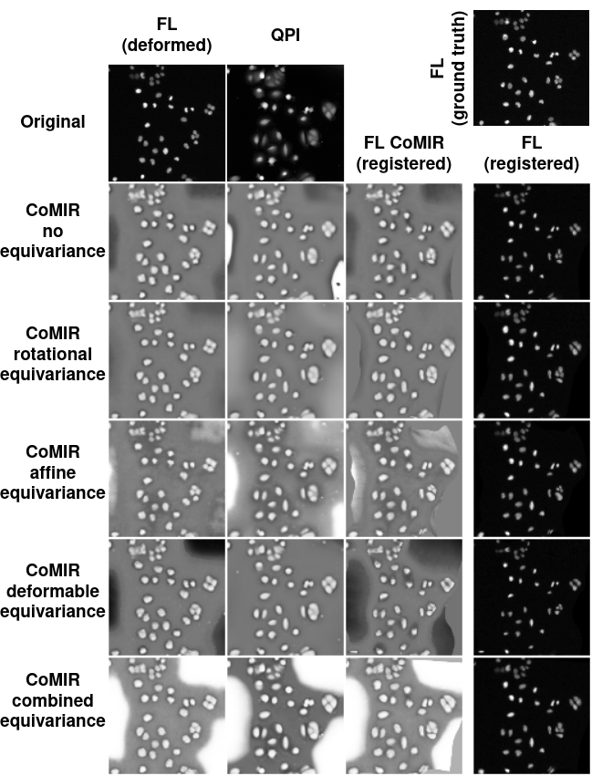
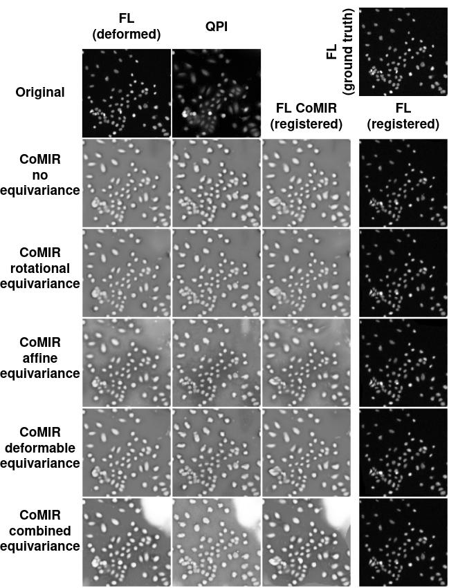
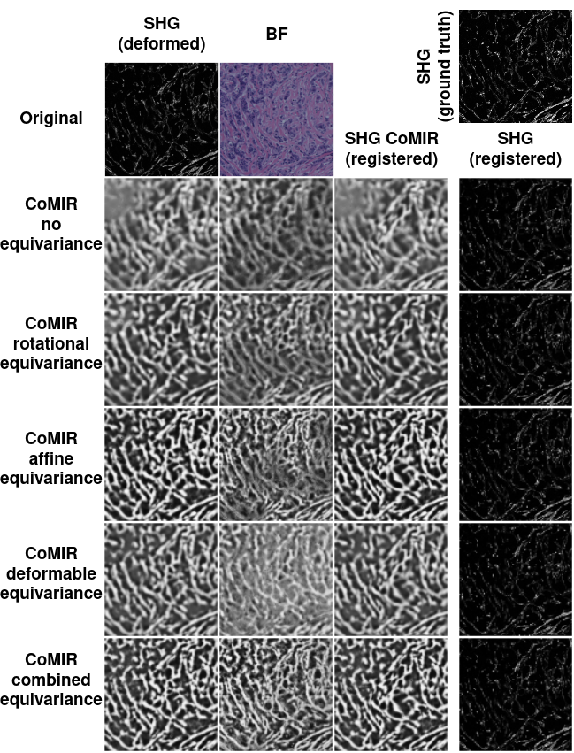
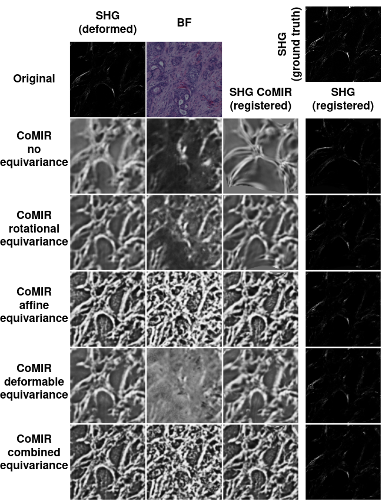
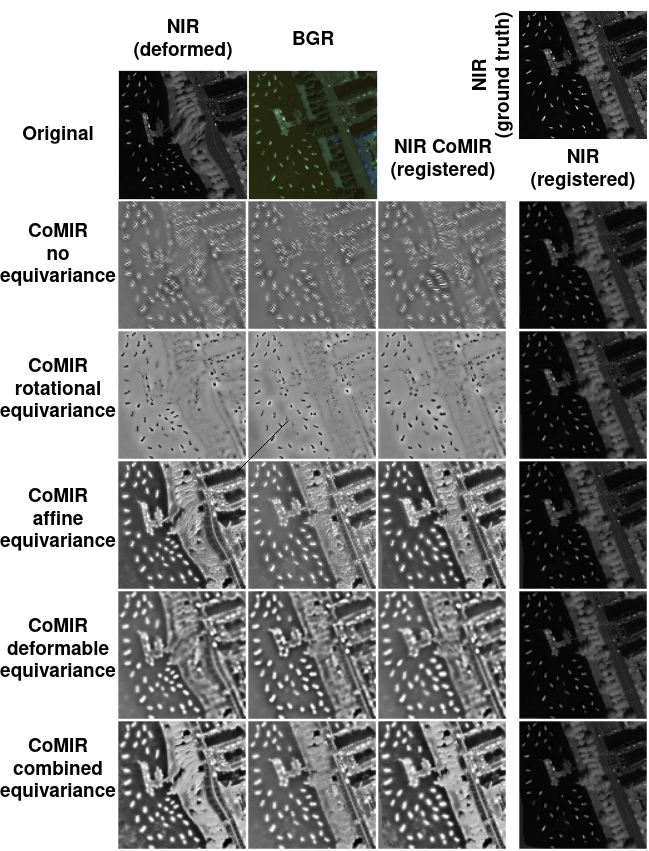
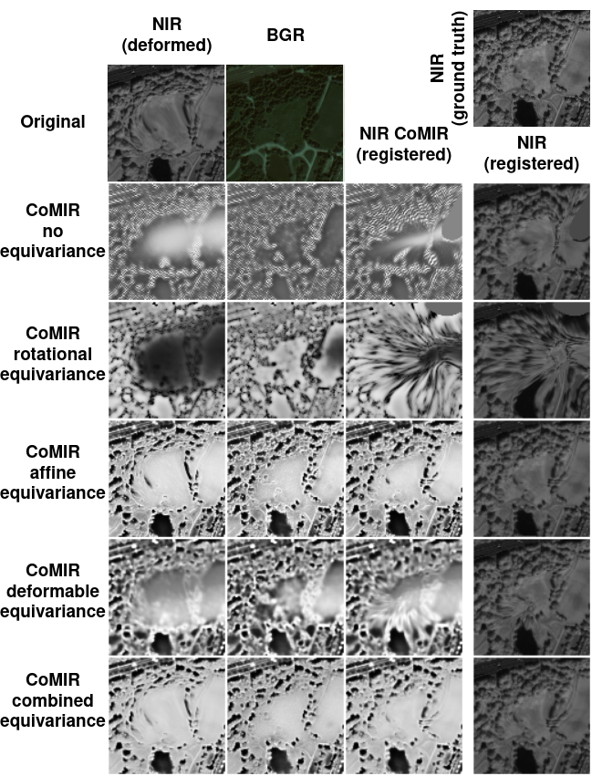

# CoMIR_INSPIRE

Code of the ISBI 2022 paper: "Contrastive Learning of Equivariant Image Representations for Multimodal Deformable Registration". L. Nordling, J. Öfverstedt, J. Lindblad, N. Sladoje. 20th IEEE International Symposium on Biomedical Imaging (ISBI), IEEE, Cartagena, Colombia, April 2023.

A method for multimodal deformable image registration which combines a powerful deep learning approach to generate CoMIRs, dense image-like representations of multimodal image pairs, with [INSPIRE](https://github.com/MIDA-group/inspire), a robust framework for monomodal deformable image registration.
Incorporates additional equivariance constraints for improved consistency of [CoMIRs](https://github.com/MIDA-group/CoMIR) under deformation. 

## Installation
See `setup_instructions.txt` for installation of prerequisities

## Training

Use `train_comir.py` for training a CoMIR model

Example command to run a model on GPU 0 with affine equivariance imposed

`CUDA_VISIBLE_DEVICES=0 python train_comir.py /path/to/modaloty/A/ /path/to/modaloty/B/ -export_folder path/to/model/save/ -logdir path/to/tensorboard/logs/ -log_a 1 -iterations 300 -l2 0.1 -equivariance affine`

For all parameters see `train_comir.py`

## Inference

To create a dataset with synthetic b-spline deformations on modality A and to generate CoMIRs run `generate_deformed_dataset.py`

`CUDA_VISIBLE_DEVICES=0 python generate_deformed_dataset.py path/to/model path/to/modality/A/ path/to/modality/B/ /path/to/generated/dataset/ <displacement>`

To only generate CoMIRs run `inference_comir.py`

## Registration

See [INSPIRE](https://github.com/MIDA-group/inspire) documentation for registration. The method can be tested and compared with *elastix* by using `test_registration.py`

To register images with generated CoMIRs, use `register_comir.py` 

# References

[1] Pielawski, N., Wetzer, E., Öfverstedt, J., Lu, J., Wählby, C., Lindblad, J., & Sladoje, N. (2020). CoMIR: Contrastive multimodal image representation for registration. Advances in neural information processing systems, 33, 18433-18444.
[2] J. Ofverstedt, J. Lindblad, and N. Sladoje, “INSPIRE: Intensity and Spatial Information-Based Deformable Image Registration” Preprint arXiv:2012.07208v2, 2023, To appear in PLOS ONE, 2023.
https://github.com/MIDA-group/inspire

# Registration examples

## Cytological Dataset
### Example 1

### Example 2

## Histological Dataset
### Example 1

### Example 2

## Zurich Dataset
### Example 1

### Example 2

